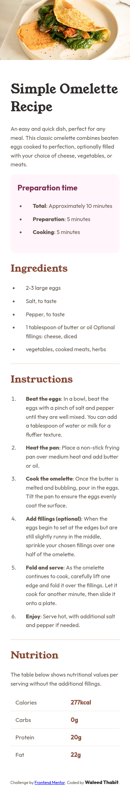
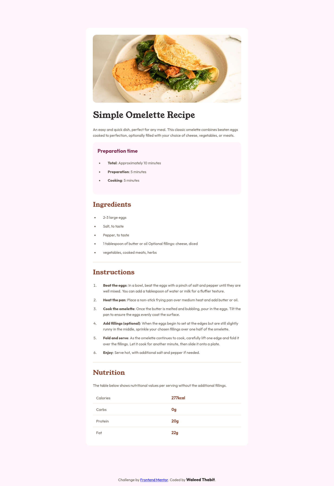

# Frontend Mentor - Recipe page solution

This is a solution to the [Recipe page challenge on Frontend Mentor](https://www.frontendmentor.io/challenges/recipe-page-KiTsR8QQKm). Frontend Mentor challenges help you improve your coding skills by building realistic projects.

## Table of contents

- [Overview](#overview)
  - [Screenshot](#screenshot)
  - [Links](#links)
- [My process](#my-process)
  - [Built with](#built-with)
  - [What I learned](#what-i-learned)
  - [AI Collaboration](#ai-collaboration)
- [Author](#author)

## Overview

### Screenshot

Mobile:



Desktop:



### Links

- Solution URL: [https://github.com/waleed-thabit/recipe-page](https://github.com/waleed-thabit/recipe-page)
- Live Site URL: [https://waleed-thabit.github.io/recipe-page/](https://waleed-thabit.github.io/recipe-page/)

## My process

### Built with

- Semantic HTML5 markup
- CSS custom properties
- Flexbox
- Mobile-first workflow
- Vanilla HTML and CSS only, no frameworks
- A real HTML `<table>` for the nutrition values

### What I learned

- **Loading fonts locally with `@font-face`**, instead of pulling them from Google Fonts. This was new to me.

```css
@font-face {
  font-family: "Young-serif";
  src: url(../assets/fonts/young-serif/YoungSerif-Regular.ttf) format("truetype");
  font-weight: 400;
  font-style: normal;
}
```

- **Structuring and styling a real HTML `<table>`.** I didn't learn anything new here, but it was a good refresher on `border-collapse`, styling individual cells, and removing a border on the last row.

```css
table {
  width: 100%;
  border-collapse: collapse;
}
td {
  border-bottom: 1px solid var(--stone-100);
  padding: calc(14 / 16 * 1rem);
}
.fat-1,
.fat-2 {
  border: 0;
}
```

- **Page structure:** a `main` containing two blocks, a `div` for the image and an `article` for the recipe content (main heading, subheadings, ingredient list, instructions, and the nutrition table).

### AI Collaboration

I did not use AI to build this project. I used **Claude** only to help me write this README.

## Author

- GitHub - [@waleed-thabit](https://github.com/waleed-thabit)
- Frontend Mentor - [@waleed-thabit](https://www.frontendmentor.io/profile/waleed-thabit)
